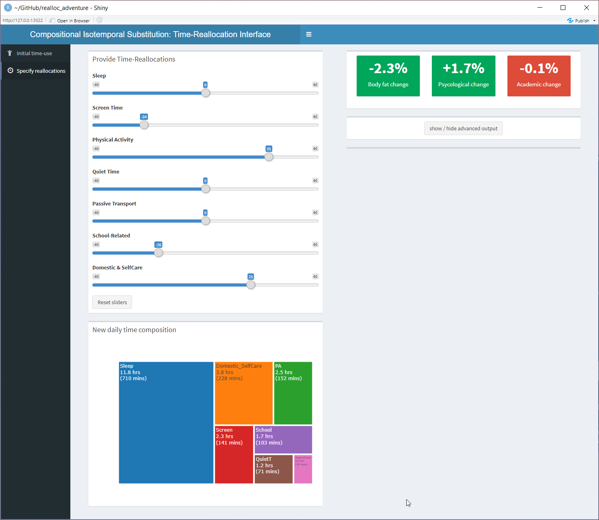
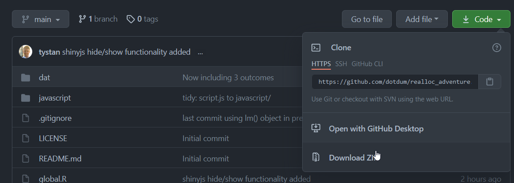

# realloc_adventure

Exploring the adiposity, physiological and academic associations of choose-your-own-adventure time reallocations between daily activities

## Description

This is a Shiny App (interactive webpage) that allows the user to input their daily time-use and proposed time-use changes to see how it affects their predicted body fat percentage, physiological well-being and academic performance.

## Using the Shiny App



The following steps will allow you to run the `realloc_adventure` Shiny App on your own computer:

* Make sure you have [R](https://cran.r-project.org/) and [RStudio](https://www.rstudio.com/products/rstudio/download/) installed.
* Go to the `Code` button on the top right of this page and then click `Download zip`.
* Unzip the download.
* Double click the `realloc_adventure.Rproj` file - this should open an RStudio session.

* (only has to be performed once) Make sure the prerequisite packages are installed by running the below command in the R console:
```r
install.packages(c("shiny", "shinydashboard", "compositions", "shinyjs", "dplyr", "ggplot2", "foreach", "r2d3"))
```
* Now to finally run the Shiny App by running the below command in the R console:
```r
library(shiny)
runApp()
```
